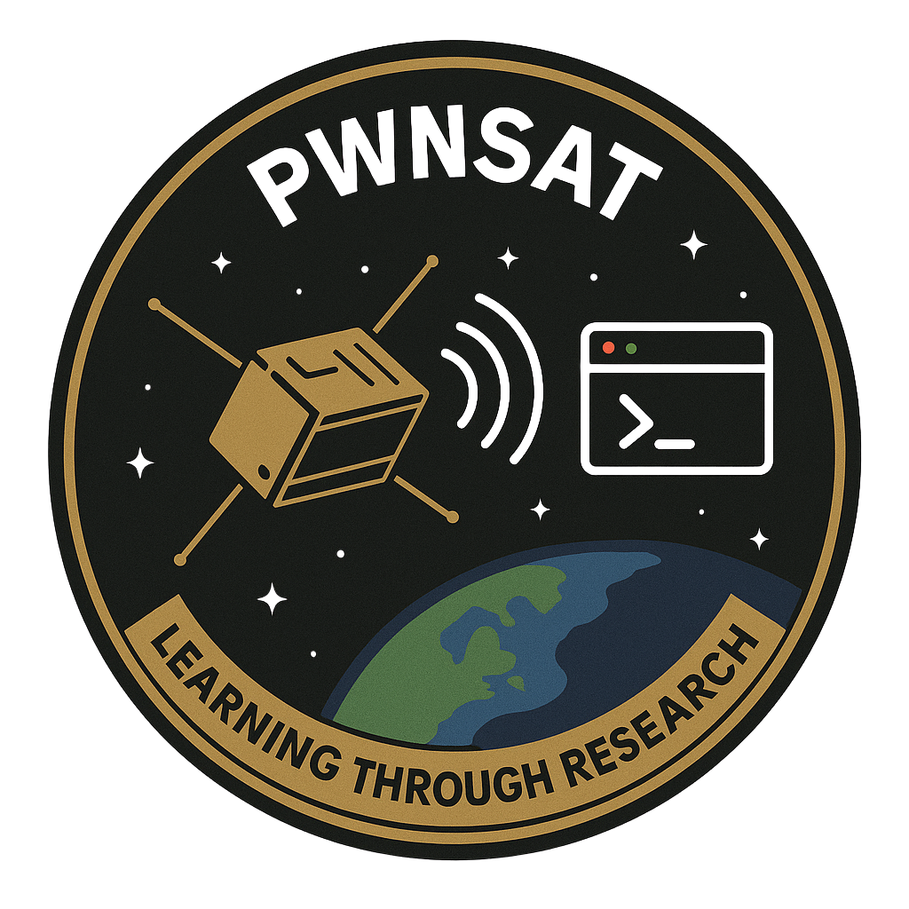

<div align="center">



# PWNSAT-C3

**The ground-station dashboard for the PWNSAT satellite platforms — live telemetry and real commands, against real hardware over USB or RF.**

</div>

---

## Welcome to PWNSAT-C3

PWNSAT-C3 is the Mission Operations Center (MOC) for the PWNSAT ecosystem: a browser dashboard that connects to a real satellite board over USB or RF, decodes its live telemetry into readable panels, and sends real telecommands.

It's built for the same audience as the boards it talks to: hackers, students, and aerospace security researchers who want to see a satellite's actual link state react in real time, not just read about CCSDS in a slide deck. Everything a demo needs — the protocol codec, the AES link, the USB framing, and the GNU Radio downlink receiver — is vendored inside this one repo. Nothing here reaches outside of it at runtime.

---

## What You Can Do With PWNSAT-C3

* **Operate Real Hardware:** Plug in a [FlatSat](https://github.com/Pwnsat/FlatSat) (RP2040, USB serial) or a [PWNCUBE](https://github.com/Pwnsat/PWNCUBE) (dual-core RV1106, USB gadget) and drive it for real — send legitimate telecommands, watch a link-state watchdog track connect/stale/lost/reboot the way a real ground station would.
* **Plug and Play, USB or RF:** FlatSat's serial port and PWNCUBE's USB gadget interface are both auto-detected — plug a board in and it's picked up automatically, no configuration needed. Point the dashboard at an RTL-SDR or HackRF instead (or in addition) and it auto-detects the connected SDR too.
* **Rehearse Attacks Safely:** One button per canned attack — reset-DoS, unauthenticated thruster control, firmware disclosure, an integer-underflow crash, and more — built from the same documented findings the physically-realistic RF versions exploit, so you can validate the effect against your own board before ever touching a HackRF.
* **Receive Real RF:** Feed the dashboard from an RTL-SDR or HackRF via the included GNU Radio LoRa flowgraph, watching the same panels update from packets actually pulled out of the air.

---

## Platform & Transport Overview

One running instance serves two satellite platforms, chosen on a mission-select screen right after login:

| Platform | Hardware | Link |
| :--- | :--- | :--- |
| **FlatSat** | RP2040-based reference board | USB CDC serial (auto-detected) and/or RF (RTL-SDR/HackRF) |
| **[PWNCUBE](https://github.com/Pwnsat/PWNCUBE)** | Dual-core (Rockchip RV1106) CubeSat | USB gadget interface and/or the same shared RF path |

The dashboard can hold several transport sources open at once (`serial`, `cube`, `radio`) and switch which one feeds the UI at runtime with no restart — commands always go out over whichever wired link is actually connected, never radio, which is receive-only. Full transport-by-transport breakdown, environment variables, and the data-flow diagram: see the [wiki](https://github.com/Pwnsat/PWNSAT-C3/wiki).

> **Authorized use only.** Every attack this dashboard can send is meant for a board, lab transmitter, or signal source you own or are explicitly authorized to test. See [License](#license).

---

## Repository Layout

| Folder | Contents |
|---|---|
| [`backend/`](backend/) | FastAPI app, transport layer (FlatSat serial, PWNCUBE USB, shared radio), telemetry decoder, link-state watchdog, tests. |
| [`frontend/`](frontend/) | Login page, mission-select screen, and the two per-platform dashboards — all self-contained HTML/CSS/JS, no build step. |
| [`pwnsat_tools/`](pwnsat_tools/) | Vendored SPP/CCSDS codec, AES-128 link, USB framing, canned-attack payload builders. |
| [`gradio/`](gradio/) | GNU Radio LoRa downlink receiver flowgraph (RTL-SDR/HackRF, via SoapySDR) and its ZeroMQ bridge into the dashboard. |

---

## Quick Start

```shell
git clone https://github.com/Pwnsat/PWNSAT-C3 PWNSAT-C3
cd PWNSAT-C3
python3 -m venv .venv && source .venv/bin/activate
pip install -r requirements.txt
```

Plug in a FlatSat or PWNCUBE board over USB, then:

```shell
uvicorn backend.app:app --app-dir .
```

No transport flags needed — the board is auto-detected. Open `http://127.0.0.1:8000/`, log in (demo defaults: **operator** / **pwnsat** — override before using this anywhere but a local rehearsal, see the [wiki](https://github.com/Pwnsat/PWNSAT-C3/wiki)), then pick your platform on the mission-select screen.

Full OS-specific instructions for Ubuntu/macOS — USB permissions, the optional RF receive path, environment variables, and troubleshooting — all live in the wiki, not here. See below.

---

## Technical Documentation and Guides (Wiki)

All deep technical documentation — install guides, architecture, and the telemetry/command protocol — has been centralized. Start here: **[PWNSAT-C3 Wiki](https://github.com/Pwnsat/PWNSAT-C3/wiki)**

* **[01. Getting Started](https://github.com/Pwnsat/PWNSAT-C3/wiki/Getting-Started):** Toolchain setup, connecting real FlatSat/PWNCUBE hardware over USB, and the optional GNU Radio/SoapySDR RF receive path.
* **[02. System Architecture](https://github.com/Pwnsat/PWNSAT-C3/wiki/System-Architecture):** The full data-flow diagram, every transport source, and a module-by-module backend/frontend reference.
* **[03. Telemetry & Command Protocol](https://github.com/Pwnsat/PWNSAT-C3/wiki/Telemetry-and-Command-Protocol):** How SPP/CCSDS packets get decoded into dashboard panels, the APID registry, and how a legitimate command gets built and sent.

---

## Collaboration and Community

This project is an open-source initiative maintained by PWNSAT and Electronic Cats. Contributions, issues, and pull requests are welcome.

## Disclaimer

This project was created for educational purposes, to teach and learn aerospace cybersecurity. Neither PWNSAT nor Electronic Cats are responsible for how the knowledge, code, or tools hosted in this repository are used. Use only against hardware, firmware, or signal sources you own or are explicitly authorized to test.

## License

MIT — see [`LICENSE`](LICENSE). Use this only against a board, lab transmitter, or signal source you own or are explicitly authorized to test.

Designed by PWNSAT and Electronic Cats.
